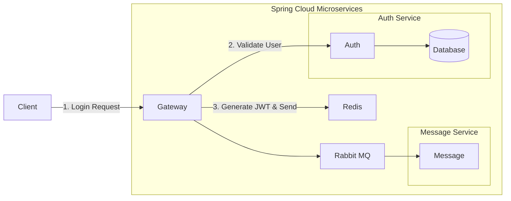
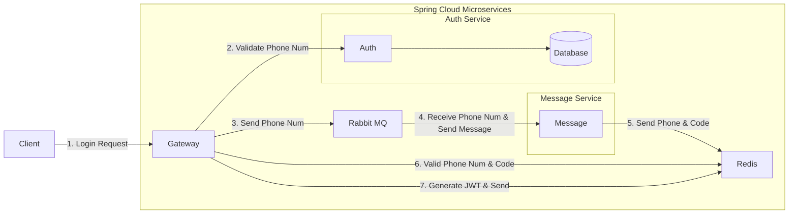
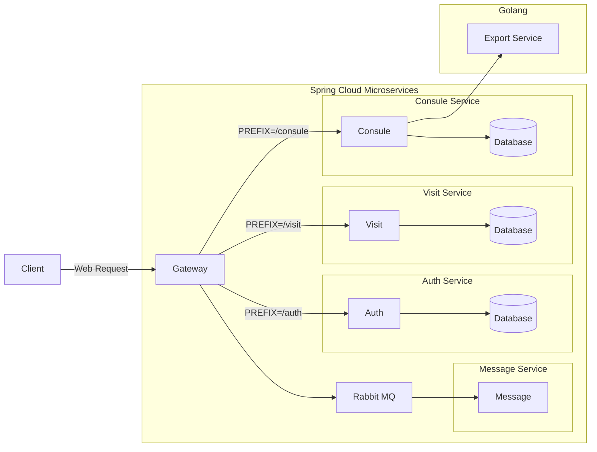

# 心理咨询系统（Psychological Counseling System）

## 项目简介

心理咨询系统是辅助线下心理咨询的线上平台。

学生可以在心理咨询系统中填写登记表，进行线上初访预约，并由管理员进行审核；审核通过后，初访员会对学生进行初访，了解大致情况；此后，咨询助理安排咨询师对学生进行心理咨询，由咨询师提交每次访问的记录，并在完成全部心理咨询后填写结案报告。

需求来源：http://wiki.suncaper.net/pages/viewpage.action?pageId=50369779

## 业务流程


### 用户登录

#### 用户根据账号密码进行登录

1. 【 客户端 】通过 `http:host:port/login/account/{account}/password/{password}` 向【 pcs-gateway 微服务 】发起登录请求
2. 【 pcs-gateway 微服务 】中的 JWT Filter 判断该请求是登录请求，放行
3. 【 pcs-gateway 微服务 】中的 Security Filter 判断该请求是登录请求，放行
4. 【 pcs-gateway 微服务 】向【pcs-auth 微服务】发起请求 
   1. 如果账号密码错误，则返回 401 UnAuthorization 错误
   2. 如果正确，则继续执行
5. 【 pcs-gateway 微服务 】基于用户的 ID 与角色（role）生成 JWT
6. 【 pcs-gateway 微服务 】将生成的 JWT 发送到【 Redis 】中，并设置过期时间
7. 【 pcs-gateway 微服务 】向【客户端】进行响应



#### 用户根据手机验证码进行登录

1. 【 客户端 】通过 `http:host:port/phone/{phone}/code` 向【 pcs-gateway 微服务 】发起发送短信验证码请求
2. 【 pcs-gateway 微服务 】中的 JWT Filter 判断该请求是申请短信验证码请求，放行
3. 【 pcs-gateway 微服务 】中的 Security Filter 判断该请求是申请短信验证码请求，放行
4. 【 pcs-gateway 微服务 】向【pcs-auth 微服务】发起请求
    1. 如果手机号错误或者非用户手机号，则返回错误
    2. 如果正确，则继续执行
5. 【 pcs-gateway 微服务 】将手机号发送至【 RabbitMQ 】
6. 【 pcs-message 微服务 】监听【 RabbitMQ 】中的指定队列，获取手机号，并生成验证码
7. 【 pcs-message 微服务 】使用【 腾讯云 SMS 服务 】向手机号发送验证码
8. 【 pcs-message 微服务 】将手机号与验证码作为键值对存放入【 Redis 】中，并设置过期时间
9. 【 客户端 】收到短信后，调用 `http:host:port/login/phone/{phone}/code/{code}` 向【 pcs-gateway 微服务 】发起登录请求
10. 【 pcs-gateway 微服务 】向【 Redis 】查看是否存在相应的键值对
    1. 如果不存在，则返回 401 UnAuthorization 错误
    2. 如果正确，则继续执行
11. 【 pcs-gateway 微服务 】基于用户的 ID 与角色（role）生成 JWT
12. 【 pcs-gateway 微服务 】将生成的 JWT 发送到【 Redis 】中，并设置过期时间
13. 【 pcs-gateway 微服务 】向【客户端】进行响应



## 业务功能


## 数据模型


## 技术选型

| 技术        | 选型                                               | 备注                                                   |
|-----------|--------------------------------------------------|------------------------------------------------------|
| 微服务注册中心   | Spring Cloud Alibaba Nacos                       ||
| 微服务配置管理中心 | Spring Cloud Alibaba Nacos                       ||
| 微服务网关     | Spring Cloud Gateway                             ||
| 负载均衡      | Spring Cloud Loadbalancer (ReactiveLoadBalancer) | 不实用 Ribbon 提供的阻塞式负载均衡，使用响应式负载均衡 ReactiveLoadBalancer |
| HTTP 客户端  | WebClient <br/> ~~(Spring Cloud OpenFeign)~~     ||
| 认证授权      | Spring Security + JWT                            |                                                      |
| Web 服务    | Spring WebFlux                                   |                                                      |
| 数据存储      | MongoDB                                          | 阿里云数据库（三节点副本集实例，价值 ¥9.99）                            |
| 云服务器      | 阿里云轻量应用服务器、腾讯云轻量应用服务器                            |                                                      |
| 短信发送      | 腾讯云 SMS                                          |                                                      |
| 缓存        | Redis Cluster ( 1 Master & 2 Salves )            | 基于 Docker Compose 的"一主二从"三节点 Redis 集群                |
| 消息队列      | RabbitMQ                                         | 阿里云 AMQP (RabbitMQ)                                  |

## 技术架构

## 微服务管理

### 微服务通信



### 端口管理

| 应用 | 微服务     | 端口    |
|--|---------|-------|
| 网关 | gateway | 12100 |
| 认证 | auth    | 12101 |
| 短信 | message | 12102 |
| 通用 | general | 12103 |
| 初访 | visit        | 12104      |
| 咨询 | consult        | 12105      |
| 值班 | duty        | 12106      |

## 部署架构

## 外部依赖

### 阿里云轻量级应用服务器

官网：https://www.aliyun.com/product/swas?spm=5176.19720258.J_8058803260.32.53352c4acnKsf2

> 轻量应用服务器 （Simple Application Server），是可快速搭建且易于管理的轻量级云服务器；提供基于单台服务器的应用部署，安全管理，运维监控等服务，一站式提升您的服务器使用体验和效率。

项目使用阿里云轻量级应用服务器进行**基于 Docker 容器的 Nacos 服务部署与 MySQL 持久化配置**。

### 腾讯云轻量级应用服务器

官网：https://cloud.tencent.com/product/lighthouse

> 轻量应用服务器（TencentCloud Lighthouse）是新一代开箱即用、面向轻量应用场景的云服务器产品，助力中小企业和开发者便捷高效的在云端构建网站、Web应用、小程序/小游戏、APP、电商应用、云盘/图床以及各类开发测试环境，相比普通云服务器更加简单易用且更贴近应用，以套餐形式整体售卖基础云资源并提供高带宽流量包，将热门开源软件融合打包实现一键构建应用，提供极简上云体验。

项目使用腾讯云轻量级应用服务器进行**基于 Docker 容器的 Redis 集群编排与部署**。

### 阿里云数据库 MongoDB 版

官网：https://www.aliyun.com/product/mongodb?spm=5176.19720258.J_8058803260.42.73b62c4aL496Gm

> 云数据库 MongoDB 版是完全兼容 MongoDB 协议、高度兼容 DynamoDB 协议的在线文档型数据库服务，支持Serverless、单节点、副本集、分片集群四种部署架构，能够满足不同的业务场景需要，在互联网（游戏、资讯、社交、电商、直播）、新零售、在线教育、金融、物联网、政企等行业都有广泛的应用。

项目使用 MongoDB 作为**数据持久化方案**。

### 阿里云消息队列 RabbitMQ 版

官网：https://www.aliyun.com/product/amqp?spm=5176.19720258.J_8058803260.94.53352c4adQCYdY

> 消息队列 RabbitMQ 版是一款基于高可用分布式存储架构实现的 AMQP 0-9-1协议的消息产品。消息队列 RabbitMQ 版兼容开源 RabbitMQ 客户端，解决开源各种稳定性痛点（例如消息堆积、脑裂等问题），同时具备高并发、分布式、灵活扩缩容等云消息服务优势。

项目使用 RabbitMQ 进行**短信业务的流量削峰**，减小服务器压力。

### 腾讯云短信 SMS

官网：https://cloud.tencent.com/product/sms

> 腾讯云短信（Short Message Service，SMS）可为广大企业级用户提供稳定可靠，安全合规的短信触达服务。用户可快速接入，调用 API / SDK 或者通过控制台即可发送，支持发送验证码、通知类短信和营销短信。国内验证短信秒级触达，99%到达率；国际/港澳台短信覆盖全球200+国家/地区，全球多服务站点，稳定可靠。

项目使用腾讯云 SMS 进行基于手机号的**用户认证与授权**业务。

## 编码实践

### 统一返回体中响应枚举类的抽象设计

在分布式、微服务盛行的今天，绝大部分项目都采用的微服务框架与前后端分离方式。前端和后端进行交互，前端按照约定请求URL路径，并传入相关参数，后端服务器接收请求，进行业务处理，返回数据给前端。

维护一套完善且规范的接口是非常有必要的， 这样不仅能够提高对接效率，也可以让代码看起来更加简洁优雅。

#### 定义

- ***code***  -  由后端统一定义各种返回结果的**状态码**
- ***data***  -  本次返回的**数据**
- ***message***  -  本次接口调用的**结果描述**

其中，*code* 与 *message* 用于对后端处理的详情进行描述。

例如，前端发起 `GET localhost:8080/the_most_handsome_person` 请求（***HTTP Request***），后端返回以下响应体（***HTTP Response Body***）：

```json
{
    "code": 0,
    "data": {
        "name": "张三",
        "age": "20"
    },
    "message": "请求成功"
}
```

#### 高可扩展抽象设计

**在实际开发中，`Result` 类更多地是被放在共用的工具库中。**

然而，**每个不同的微服务/业务可能都有自己的状态码**，甚至每个接口都可能会有（根据自己的设计），而**每次调用 `Result.success(...)` 都会造成一段极为冗长的代码**。

观察到**每次代码调用都要调用枚举类型的 `getCode()` 与 `getMessage()` 方法**（例如 `return Result.success(zhangsan, ResultEnum.SUCCESS.getCode(), ResultEnum.SUCCESS.getMessage());`），故可以将这两个方法抽离成接口（***extract interface***）

```java
public interface ResultEnumerable {
    Integer getCode();

    String getMessage();

    @Override
    String toString();  /*  可选  */
}
```

自定义返回枚举类，并实现 `ResultEnumerable` 接口：

```java
public enum DefaultResultEnum implements ResultEnumerable {
    SUCCESS(0, "Success"), // 请求成功
    ERROR(1, "Error"); // 请求失败

    private final Integer code;

    private final String message;

    DefaultResultEnum(Integer code, String message) {
        this.code = code;
        this.message = message;
    }

    @Override
    public Integer getCode() {
        return code;
    }

    @Override
    public String getMessage() {
        return message;
    }

    @Override
    public String toString() {
        return "ResultEnum{" +
                "code=" + code +
                ", message='" + message + '\'' +
                '}';
    }
}
```

对 `Result` 类增加参数类型为 `ResultEnumerable` 的方法，在运行时多态调用接口的方法：

```java
public class Result<T> implements Serializable {
    private static final Long serialVersionUID = 9192910608408209894L;
    
    private final T data;
    private final Integer code;
    private final String message;

    private Result(T data, Integer code, String message) {
        this.data = data;
        this.code = code;
        this.message = message;
    }

    // 增加方法，参数类型为 ResultEnumerable 接口
    public static <T> Result<T> success(T data, ResultEnumerable resultEnum) {
        return new Result<>(data, resultEnum.getCode(), resultEnum.getMessage());
    }

    public static <T> Result<T> success(T data, int code, String message) {
        return new Result<>(data, code, message);
    }
        
    // 增加方法，参数类型为 ResultEnumerable 接口
    public static <T> Result<T> error(T data, ResultEnumerable resultEnum) {
        return new Result<>(data, resultEnum.getCode(), resultEnum.getMessage());
    }

    public static <T> Result<T> error(T data, int code, String message) {
        return new Result<>(data, code, message);
    }
}
```

此时，不需要再调用 `Result.success(zhangsan, ResultEnum.SUCCESS.getCode(), ResultEnum.SUCCESS.getMessage());`，只需要**调用 `Result.success(zhangsan, ResultEnum.SUCCESS)`** 即可：

```java
class Person {
    private String name;
    private Integer age;
    
    public Person(String name, Integer age) {
        this.name = name;
        this.age = age;
    }
    
    // 省略构造器、getter/setter、toString 等方法
}

@RestController
public class TestController {
    @GetMapping("/the_most_handsome_person")
 	public Result<?> theMostHandsomePerson() {
        Person zhangsan = new Person("张三", 20);
        
        return Result.success(zhangsan, ResultEnum.SUCCESS); // 使用枚举即可
    }   
}
```

#### 优点

##### 易用性极高

在实际开发中，**只需要将 `Result` 类与 `ResultEnumerable` 接口放在自己的项目代码中**即可，无其他依赖。

##### 可扩展性极高

在自己的实际业务中，**只需要实现 `ResultEnumerable` 接口**，就可以实现自己的枚举类！

```java
public enum UserResultEnum implements ResultEnumerable {
    SUCCESS(0, "Success"), // 请求成功
    USER_NOT_FOUND(1, "User not found"), // 没有该用户
    USER_INFO_IS_PRIVATE(2, "User's information is private"); // 用户信息是隐私

    private final Integer code;

    private final String message;

    DefaultResultEnum(Integer code, String message) {
        this.code = code;
        this.message = message;
    }

    @Override
    public Integer getCode() {
        return code;
    }

    @Override
    public String getMessage() {
        return message;
    }

    @Override
    public String toString() {
        return "ResultEnum{" +
                "code=" + code +
                ", message='" + message + '\'' +
                '}';
    }
}
```

##### 可读性极高

**命名清晰的枚举可以清晰地表述实际信息**（例如 `USER_NOT_FOUND`）：

```java
import static com.example.demo.result.UserResultEnum.*;

@RestController
public class TestController {
    @GetMapping("/the_most_handsome_person")
 	public Result<?> theMostHandsomePerson() {
        Person zhangsan = new Person("张三", 20);
        
        // 代码内容：Result.success(zhangsan, SUCCESS)
        // 实际含义： 返回    成功     张三       成功
        // return Result.success(zhangsan, SUCCESS);
        
        // 代码内容：Result.error(null, USER_NOT_FOUND)
        // 实际含义： 返回    失败          没有该用户
        return Result.error(null, USER_NOT_FOUND);
    }   
}
```

该抽象设计以作为博客文章上传至网上：https://blog.csdn.net/m0_46261993/article/details/123253948?spm=1001.2014.3001.5501

## 环境搭建

### Nacos

项目使用 Docker 容器运行 Nacos 实例用于**服务注册中心**与**服务配置中心**。

基于 Docker 搭建 MySQL 实例作为 Nacos 服务配置中心的持久化容器，并搭建 Docker Network 对 Nacos 实例与 MySQL 实例进行连接。

Nacos 搭建过程参考 [nacos/setup.md](nacos/setup.md)。


### ELK

参考 [elk/elk.md](elk/setup.md)

### Redis

项目基于 Docker 搭建**一主两从**的高可用 Redis 集群，并使用 Docker Compose 进行服务编排。

```shell
cd ./redis

docker-compose up -d
```

## 本地运行

### gateway

在执行 jar 时，增加命令行参数：
```shell
# Nacos 服务发现中心
--spring.cloud.nacos.discovery.server-addr=your-host:your-port

# Nacos 配置中心
--spring.cloud.nacos.config.server-addr=your-host:your-port
```

### auth

在执行 jar 时，增加命令行参数：
```shell
# Nacos 服务发现中心
--spring.cloud.nacos.discovery.server-addr=your-host:your-port

# Nacos 配置中心
--spring.cloud.nacos.config.server-addr=your-host:your-port
```

### message

在执行 jar 时，增加命令行参数：
```shell
# Nacos 服务发现中心
--spring.cloud.nacos.discovery.server-addr=your-host:your-port

# Nacos 配置中心
--spring.cloud.nacos.config.server-addr=your-host:your-port
```

## FAQ
