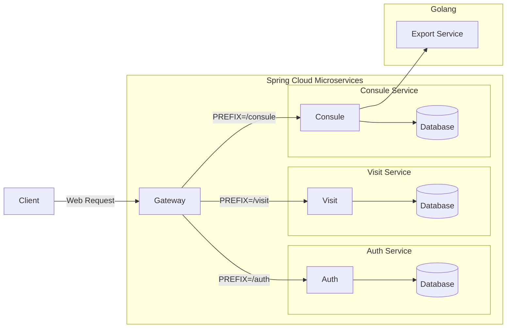

# 心理咨询系统（Psychological Counseling System）

## 项目简介

心理咨询系统是辅助线下心理咨询的线上平台。

学生可以在心理咨询系统中填写登记表，进行线上初访预约，并由管理员进行审核；审核通过后，初访员会对学生进行初访，了解大致情况；此后，咨询助理安排咨询师对学生进行心理咨询，由咨询师提交每次访问的记录，并在完成全部心理咨询后填写结案报告。

需求来源：http://wiki.suncaper.net/pages/viewpage.action?pageId=50369779

## 业务流程


## 业务功能


## 数据模型


## 技术选型

| 技术        | 选型                                               | 备注                                                   |
|-----------|--------------------------------------------------|------------------------------------------------------|
| 微服务注册中心   | Spring Cloud Alibaba Nacos                       ||
| 微服务配置管理中心 | Spring Cloud Alibaba Nacos                       ||
| 微服务网关     | Spring Cloud Gateway                             ||
| 负载均衡      | Spring Cloud Loadbalancer (ReactiveLoadBalancer) | 不实用 Ribbon 提供的阻塞式负载均衡，使用响应式负载均衡 ReactiveLoadBalancer |
| HTTP 客户端  | Spring Cloud OpenFeign                           ||
| 认证授权      | Spring Security + JWT                            |                                                      |
| Web 服务    | Spring WebFlux                                   |                                                      |
| 数据存储      | MongoDB                                          | 阿里云数据库（三节点副本集实例，价值 ¥9.99）                            |
| 云服务器      | 阿里云轻量应用服务器、腾讯云轻量应用服务器                            |                                                      |

## 技术架构

## 微服务管理

### 微服务通信



### 端口管理

| 应用  | 微服务     | 端口    |
|-----|---------|-------|
| 网关  | gateway | 12100 |
| 认证  | auth    | 12101 |

## 部署架构

## 外部依赖

## 编码实践

## 环境搭建

### Nacos

参考 [nacos/setup.md](nacos/setup.md) 

### ELK

参考 [elk/elk.md](elk/setup.md)

## 本地运行

### gateway

在执行 jar 时，增加命令行参数：
```shell
# Nacos 服务发现中心
--spring.cloud.nacos.discovery.server-addr=your-host:your-port

# Nacos 配置中心
--spring.cloud.nacos.config.server-addr=your-host:your-port
```

### auth

在执行 jar 时，增加命令行参数：
```shell
# Nacos 服务发现中心
--spring.cloud.nacos.discovery.server-addr=your-host:your-port

# Nacos 配置中心
--spring.cloud.nacos.config.server-addr=your-host:your-port
```

## FAQ
