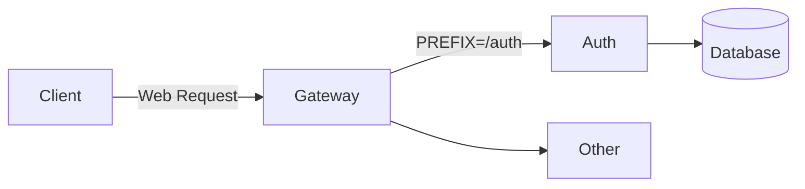

# 心理咨询系统（Psychological Counseling System）

## 项目简介

心理咨询系统是辅助线下心理咨询的线上平台。

学生可以在心理咨询系统中填写登记表，进行线上初访预约，并由管理员进行审核；审核通过后，初访员会对学生进行初访，了解大致情况；此后，咨询助理安排咨询师对学生进行心理咨询，由咨询师提交每次访问的记录，并在完成全部心理咨询后填写结案报告。

需求来源：http://wiki.suncaper.net/pages/viewpage.action?pageId=50369779
 
## 技术选型

| 技术        | 选型                                               | 备注                                                   |
|-----------|--------------------------------------------------|------------------------------------------------------|
| 微服务注册中心   | Spring Cloud Alibaba Nacos                       ||
| 微服务配置管理中心 | Spring Cloud Alibaba Nacos                       ||
| 微服务网关     | Spring Cloud Gateway                             ||
| 负载均衡      | Spring Cloud Loadbalancer (ReactiveLoadBalancer) | 不实用 Ribbon 提供的阻塞式负载均衡，使用响应式负载均衡 ReactiveLoadBalancer |
| HTTP 客户端  | Spring Cloud OpenFeign                           ||

## 技术架构

## 微服务管理

### 微服务通信

### 端口管理

| 应用  | 微服务     | 端口    |
|-----|---------|-------|
| 网关  | gateway | 12100 |
| 认证  | auth    | 12101 |

## 部署架构

## 外部依赖

## 编码实践

## FAQ
